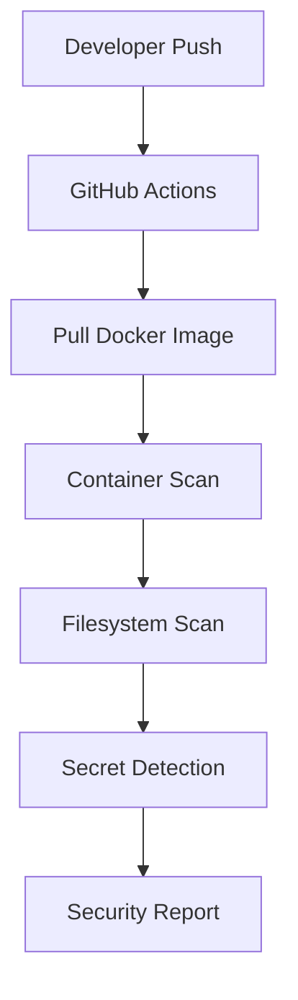

# DevSecOps Juice Shop Lab

[](https://github.com/delgadoroberto/devsecops-juice-shop-lab/actions/workflows/pipeline.yml)
[](LICENSE)


A hands-on DevSecOps laboratory demonstrating how automated security controls can be integrated into a Continuous Integration (CI) pipeline using **GitHub Actions**, **Docker**, **OWASP Juice Shop**, and **Trivy**.

The repository focuses on automated container security scanning, filesystem analysis, and secret detection, following Shift-Left Security principles.

---

# Objectives

This laboratory demonstrates how to:

- Build a simple DevSecOps security pipeline.
- Scan Docker images for vulnerabilities.
- Scan the repository filesystem.
- Detect exposed secrets.
- Understand how automated security controls integrate into CI pipelines.
- Analyze security findings generated by Trivy.
- Learn basic remediation workflows.

---

# Architecture

```
Developer
    │
    ▼
GitHub Repository
    │
    ▼
GitHub Actions
    │
 ┌──┴───────────────┐
 │                  │
 ▼                  ▼
Container Scan   Filesystem Scan
        │
        ▼
 Secret Detection
        │
        ▼
 Security Report
```

Detailed architecture documentation is available in:

- docs/architecture.md

---

# Repository Structure

```text
devsecops-juice-shop-lab/
│
├── .github/
│   └── workflows/
│       └── pipeline.yml
│
├── docs/
│   ├── architecture.md
│   ├── pipeline.md
│   └── screenshots/
│
├── docker-compose.yml
├── README.md
├── SECURITY.md
├── CONTRIBUTING.md
├── CODE_OF_CONDUCT.md
└── LICENSE
```

---

# Technologies

- GitHub Actions
- Docker
- OWASP Juice Shop
- Trivy
- YAML

---

# Security Controls

The pipeline currently performs the following security checks:

| Control | Tool |
|----------|------|
| Container Image Scan | Trivy |
| Filesystem Scan | Trivy |
| Secret Detection | Trivy |

---

# Running the Lab

## Clone the repository

```bash
git clone https://github.com/YOUR_GITHUB_USERNAME/devsecops-juice-shop-lab.git

cd devsecops-juice-shop-lab
```

---

## Start OWASP Juice Shop

```bash
docker compose up -d
```

Application:

```
http://localhost:3000
```

---

## Execute the GitHub Actions Pipeline

Simply push changes to the **main** branch.

GitHub Actions will automatically execute:

- Checkout repository
- Pull OWASP Juice Shop image
- Container image scan
- Filesystem scan
- Secret detection

---

# Pipeline Overview

The GitHub Actions workflow automates the following process:



---

# Expected Results

This repository intentionally scans **OWASP Juice Shop**, a deliberately vulnerable application developed for security education.

As a result, the pipeline is expected to identify security findings such as:

- Dependency vulnerabilities
- Vulnerable packages
- Embedded private keys
- Security misconfigurations
- Hardcoded secrets

Because this laboratory demonstrates automated security validation, **a failed pipeline is considered a successful demonstration** when vulnerabilities or secrets are detected.

---

# Example Findings

Typical findings may include:

- CVE entries affecting application dependencies.
- Embedded RSA private keys.
- Vulnerable Node.js packages.
- Secret detection inside application files.

These findings illustrate how automated security scanning helps identify risks early in the software development lifecycle.

---

# Documentation

Additional documentation is available under the **docs/** directory.

| Document | Description |
|----------|-------------|
| architecture.md | Laboratory architecture |
| pipeline.md | GitHub Actions workflow |
| trivy.md *(coming soon)* | Trivy overview |
| remediation.md *(coming soon)* | Vulnerability remediation |

---

# Learning Outcomes

After completing this laboratory, you should understand:

- Shift-Left Security
- CI security automation
- Container vulnerability scanning
- Secret detection
- GitHub Actions security workflows
- Basic DevSecOps practices

---

# Roadmap

Future improvements may include:

- CodeQL integration
- Semgrep integration
- Hadolint
- SBOM generation
- SARIF reports
- GitHub Security Dashboard
- Dependency Review
- Dockerfile linting

---

# Contributing

Contributions are welcome.

Please read:

- CONTRIBUTING.md
- CODE_OF_CONDUCT.md
- SECURITY.md

before submitting pull requests.

---

# License

This project is licensed under the MIT License.

See the LICENSE file for details.

---

# Disclaimer

OWASP Juice Shop is intentionally vulnerable and is included exclusively for educational and security testing purposes.

Do not deploy this application in production environments.

---

## Author

Developed as part of a personal DevSecOps portfolio focused on secure software development, CI/CD security automation, container security, and vulnerability management.
