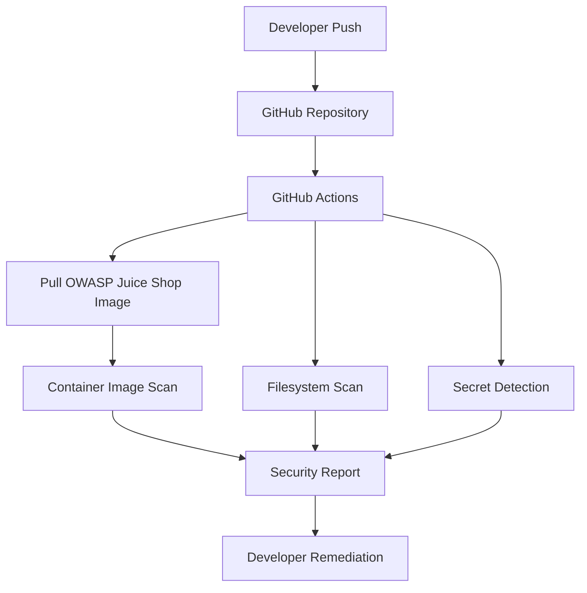

# Laboratory Architecture

## Overview

The DevSecOps Juice Shop Lab demonstrates how automated security testing can be integrated into a Continuous Integration (CI) pipeline.

The laboratory combines a deliberately vulnerable web application, containerization technologies, and automated security scanning to illustrate fundamental DevSecOps practices.

The primary objective is to show how security controls can automatically identify vulnerabilities and exposed secrets before software reaches production.

---

# High-Level Architecture

```text
                    Developer
                        │
                        │ Push
                        ▼
              GitHub Repository
                        │
                        ▼
             GitHub Actions Runner
                        │
        ┌───────────────┼────────────────┐
        │               │                │
        ▼               ▼                ▼
 Image Scan      Filesystem Scan    Secret Scan
    (Trivy)          (Trivy)           (Trivy)
        │               │                │
        └───────────────┼────────────────┘
                        ▼
                Security Findings
                        │
                        ▼
                 Remediation Actions
```

---

# Workflow Architecture



---

# Components

## GitHub Repository

The repository stores the laboratory source code, GitHub Actions workflows, Docker configuration, documentation, and intentionally insecure examples used for educational purposes.

---

## GitHub Actions

GitHub Actions provides the Continuous Integration (CI) platform responsible for executing automated security checks whenever changes are pushed to the repository.

The pipeline automates repetitive security tasks without requiring manual intervention.

---

## OWASP Juice Shop

OWASP Juice Shop is a deliberately vulnerable web application designed for security education and awareness.

Within this laboratory, it serves as the target application used during container security assessments.

---

## Docker

Docker provides a lightweight and reproducible runtime environment for OWASP Juice Shop.

Using containers ensures that every execution of the laboratory remains consistent regardless of the underlying operating system.

---

## Trivy

Trivy is the primary security scanner used throughout the laboratory.

Its responsibilities include:

- Container image vulnerability scanning
- Filesystem scanning
- Secret detection

Additional Trivy capabilities such as SBOM generation and configuration scanning can be incorporated as future enhancements.

---

# Security Workflow

The security workflow follows a simple DevSecOps approach:

1. A developer pushes changes to the repository.
2. GitHub Actions starts the CI pipeline.
3. The OWASP Juice Shop image is downloaded.
4. Trivy scans the container image.
5. Trivy scans the repository filesystem.
6. Trivy searches for hardcoded secrets.
7. Findings are reported.
8. Security issues are remediated.
9. The pipeline is executed again to validate the fixes.

This feedback loop helps detect security issues early in the software development lifecycle.

---

# Security Controls

The laboratory currently demonstrates the following automated controls:

| Control | Purpose |
|----------|---------|
| Container Image Scan | Detect vulnerabilities inside Docker images |
| Filesystem Scan | Identify insecure project contents |
| Secret Detection | Detect accidentally committed credentials |

---

# Design Principles

The laboratory has been designed according to the following principles:

- Simplicity
- Reproducibility
- Automation
- Shift-Left Security
- Educational focus
- Practical demonstrations

The repository intentionally avoids unnecessary complexity while still reflecting common DevSecOps practices used in modern CI pipelines.

---

# Future Architecture Enhancements

Future versions of this laboratory may include additional security controls such as:

- CodeQL
- Semgrep
- Hadolint
- SBOM generation
- Dependency Review
- SARIF report uploads
- GitHub Security Dashboard integration

These enhancements would expand the laboratory while maintaining its educational focus.

---

# Summary

This architecture demonstrates a straightforward DevSecOps workflow where automated security controls are integrated into a CI pipeline.

Although intentionally simple, the laboratory reflects many of the concepts and practices used in real-world software development environments, making it an effective platform for learning automated application security.
