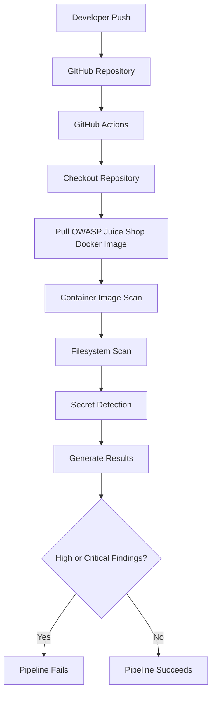

# CI/CD Pipeline

## Overview

This laboratory demonstrates how security testing can be integrated into a Continuous Integration (CI) pipeline using GitHub Actions.

Whenever changes are pushed to the repository, GitHub Actions automatically executes a series of security checks against both the project and the OWASP Juice Shop container image.

The objective is to detect security issues as early as possible in the software development lifecycle, following the Shift-Left Security approach.

---

# Pipeline Workflow



---

# Pipeline Stages

## Stage 1 – Checkout Repository

The workflow begins by checking out the repository contents.

This step allows GitHub Actions to access the project files required for subsequent security scans.

Current action:

```yaml
uses: actions/checkout@v4
```

---

## Stage 2 – Pull Container Image

The latest OWASP Juice Shop Docker image is downloaded from Docker Hub.

```bash
docker pull bkimminich/juice-shop
```

The downloaded image becomes the target of the container vulnerability scan.

---

## Stage 3 – Container Image Scan

Trivy analyzes the Docker image searching for known vulnerabilities.

The scan focuses on:

- HIGH vulnerabilities
- CRITICAL vulnerabilities

If vulnerabilities matching the configured severity threshold are detected, the workflow can fail depending on the configured exit code.

---

## Stage 4 – Filesystem Scan

Trivy scans the repository filesystem.

Typical findings include:

- Vulnerable dependencies
- Configuration issues
- Security-related files
- Misconfigurations

This scan provides an additional layer of visibility beyond the container image itself.

---

## Stage 5 – Secret Detection

The repository is scanned for accidentally committed credentials.

Examples include:

- AWS Access Keys
- GitHub Personal Access Tokens
- API Keys
- Passwords
- Private Keys

This laboratory intentionally includes a sample secret to demonstrate automated detection.

---

## Stage 6 – Security Results

After completing all scans, GitHub Actions displays the results in the workflow logs.

Depending on the configured policy, the workflow may:

- Complete successfully
- Fail due to detected vulnerabilities
- Fail due to exposed secrets

---

# Failure Conditions

The current laboratory is configured to fail the pipeline when HIGH or CRITICAL vulnerabilities are detected during the container image scan.

This behavior helps prevent vulnerable artifacts from progressing further through the software delivery process.

---

# Current Pipeline Components

| Stage | Tool | Purpose |
|--------|------|---------|
| Checkout | GitHub Actions | Download repository contents |
| Pull Image | Docker | Download OWASP Juice Shop |
| Image Scan | Trivy | Detect container vulnerabilities |
| Filesystem Scan | Trivy | Scan repository contents |
| Secret Detection | Trivy | Detect exposed credentials |

---

# Security Benefits

Integrating security directly into the CI pipeline provides several advantages:

- Early vulnerability detection
- Automated security validation
- Reduced manual effort
- Consistent scanning across every commit
- Faster developer feedback
- Improved software security posture

---

# Current Limitations

To keep this laboratory focused and easy to understand, the current pipeline intentionally omits several advanced security controls.

Examples include:

- Static Application Security Testing (SAST)
- Dynamic Application Security Testing (DAST)
- Infrastructure as Code scanning
- Dependency Review
- Software Bill of Materials (SBOM)
- Container signing
- Policy-as-Code

These features may be added as future enhancements.

---

# Future Improvements

Potential improvements include:

- CodeQL integration
- Semgrep integration
- Hadolint analysis
- SBOM generation
- SARIF report uploads
- GitHub Security Dashboard integration
- Dependency Review
- Dockerfile linting

---

# Summary

This pipeline demonstrates a practical implementation of automated security testing within a CI environment.

Although intentionally simple, it reflects the core DevSecOps principle of integrating security into every stage of the software development lifecycle through repeatable and automated processes.
